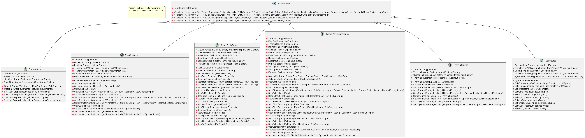
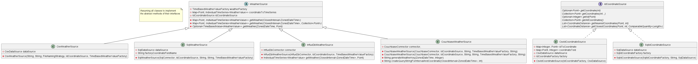

# I/O

The PowerSystemDataModel library additionally offers I/O-capabilities.
In the long run, it is our aim to provide many different source and sink technologies.
Therefore, the I/O-package is structured as highly modular.

```{toctree}
---
maxdepth: 2
---
csvfiles
sql
influxdb
ValidationUtils.md
```

## Data sink structure

[](../_static/figures/uml/DataSinkClassDiagram.png)

## Data source structure

The sources are divided in three blocks:
1. InputEntities and ResultEntities
2. TimeSeries related sources
3. Weather and Coordinate sources

[](../_static/figures/uml/EntitySourceClassDiagram.png)

[](../_static/figures/uml/TimeSeriesSourceClassDiagram.png)

[](../_static/figures/uml/WeatherCoordinateSourceClassDiagram.png)

The function to read the sources are implemented in the DataSource classes.

[](../_static/figures/uml/FunctionalDataSourceClassDiagram.png)

## Data deployment

[](../_static/figures/uml/InputDataDeployment.png)
