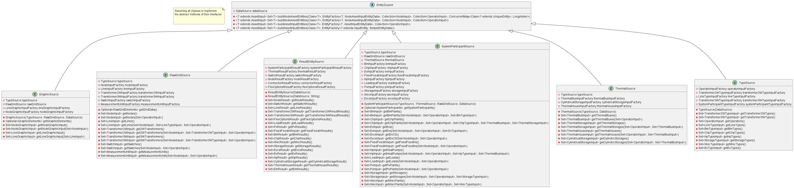
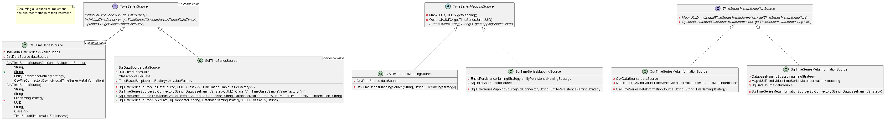
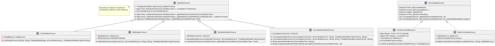
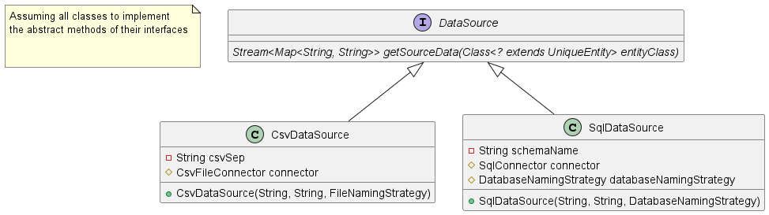

###
I/O
###
The PowerSystemDataModel library additionally offers I/O-capabilities.
In the long run, it is our aim to provide many different source and sink technologies.
Therefore, the I/O-package is structured as highly modular.

.. toctree::
:maxdepth: 2

csvfiles
sql
influxdb
ValidationUtils.md

Data sink structure
===================
.. figure:: ../_static/figures/uml/DataSinkClassDiagram.png
:align: center
:width: 650
:alt: Class diagram of data sink classes

Data source structure
=====================

The sources are divided in three blocks:
#. InputEntities and ResultEntities
#. TimeSeries related sources
#. Weather and Coordinate sources

:align: center
:width: 650
:alt: Class diagram of entity sources

:align: center
:width: 650
:alt: Class diagram of time series sources

:align: center
:width: 650
:alt: Class diagram of weather and coordinate sources

The function to read the sources are implemented in the DataSource classes.

:align: center
:width: 650
:alt: Class diagram of data sources

Data deployment
===============
.. figure:: ../_static/figures/uml/InputDataDeployment.png
:align: center
:width: 650
:alt: Diagram of input data deployment
