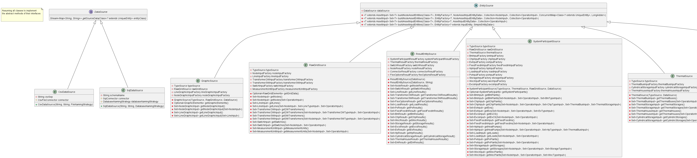

***
I/O
***
The PowerSystemDataModel library additionally offers I/O-capabilities.
In the long run, it is our aim to provide many different source and sink technologies.
Therefore, the I/O-package is structured as highly modular.

Implemented Data Connectors
=================================
.. toctree::
   :maxdepth: 2

   influxdb
   csvfiles

De-Serialization (loading models)
=================================
At the end, having an instance of :ref:`Grid Container<grid_container_model>` is the goal.
It consists of the three main blocks:

   1. :ref:`Raw grid elements<grid_container_raw_grid_elements>`
   2. :ref:`System participants<grid_container_system_participants>`
   3. :ref:`Graphics<grid_container_graphics>`

Those blocks are also reflected in the structure of data source interface definitions.
There is one source for each of the containers, respectively.

   Class diagram of data sources

As a full data set has references among the models (e.g. a line model points to its' nodes it connects), there is a
hierarchical structure, in which models have to be loaded.
Therefore, the different sources have also references among themselves.
An application example to load an *exampleGrid* from csv files located in :code:`./exampleGrid` could look like this:

.. code-block:: java

   /* Parameterization */
   String csvSep = ";"
   String folderPath = "./exampleGrid"
   FileNamingStrategy namingStrategy = new FileNamingStrategy() // Default naming strategy

   /* Instantiating sources */
   TypeSource typeSource = new CsvTypeSource(csvSep, folderPath, namingStrategy)
   RawGridSource rawGridSource = new CsvRawGridSource(csvSep, folderPath, namingStrategy, typeSource)
   ThermalSource thermalSource = new CsvThermalSource(csvSep, folderPath, namingStrategy, typeSource)
   ParticipantSource participantSource = new CsvSystemParticipantSource(
     csvSep,
     folderPath,
     namingStrategy,
     typeSource,
     thermalSource,
     rawGridSource
   )
   GraphicSource graphicsSource = new CsvGraphicSource(
     csvSep,
     folderPath,
     namingStrategy,
     typeSource,
     rawGridSource
   )

   /* Loading models */
   RawGridElements rawGridElements = rawGridSource.getGridData.orElseThrow(
         () -> new SourceException("Error during reading of raw grid data.")
      )
   SystemParticipants systemParticipants = systemParticipantSource.getGridData.orElseThrow(
         () -> new SourceException("Error during reading of raw grid data.")
      )
   GraphicElements graphicElements = graphicsSource.getGraphicElements.orElseThrow(
         () -> new SourceException("Error during reading of graphic elements data.")
      )
   JointGridContainer fullGrid = new JointGridContainer(
     gridName,
     rawGridElements,
     systemParticipants,
     graphicElements
   )

As observable from the code, it doesn't play a role, where the different parts come from.
It is also a valid solution, to receive types from file, but participants and raw grid elements from a data base.
Only prerequisite: An implementation of the different interfaces for the desired data sink.

Serialization (writing models)
==============================
Serializing models is a bit easier:

.. code-block:: java

   /* Parameterization */
   String csvSep = ";"
   String folderPath = "./exampleGrid"
   FileNamingStrategy namingStrategy = new FileNamingStrategy()
   boolean initEmptyFiles = false

   /* Instantiating the sink */
   DataSink sink = new CsvFileSink(folderPath, namingStrategy, initEmptyFiles, csvSep)
   sink.persistJointGridContainer(grid)

The sink takes a collection of model suitable for serialization and handles the rest (e.g. unboxing of nested models)
on its own.
But caveat: As the (csv) writers are implemented in a concurrent, non-blocking way, duplicates of nested models could
occur.