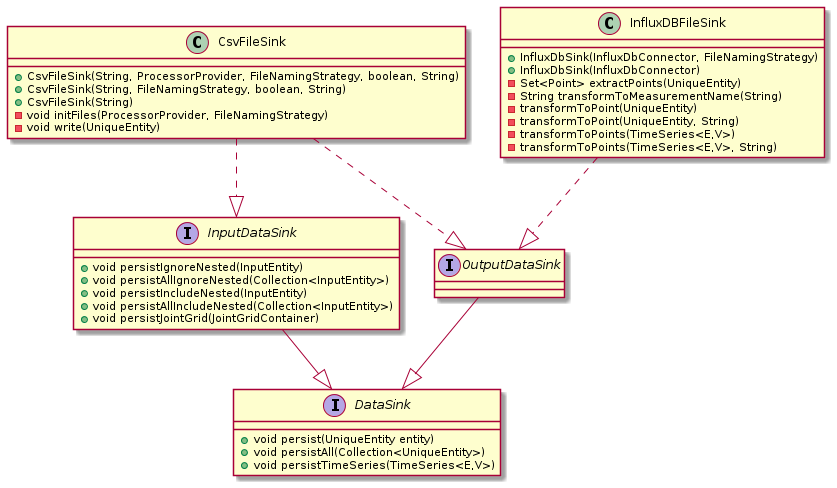

###
I/O
###
The PowerSystemDataModel library additionally offers I/O-capabilities.
In the long run, it is our aim to provide many different source and sink technologies.
Therefore, the I/O-package is structured as highly modular.

.. toctree::
   :maxdepth: 2

   csvfiles
   sql
   influxdb
   ../models/ValidationUtils.md

Data sink structure
===================

Data deployment
===============

