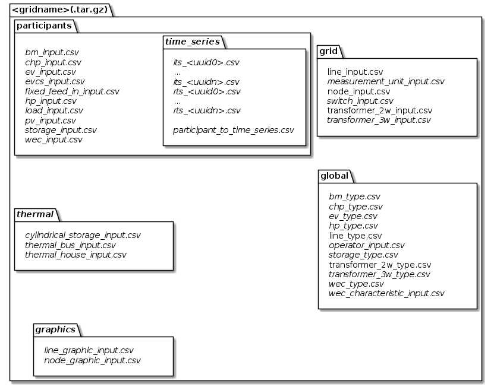

*********
csv files
*********

Default naming strategy
=======================
There is a default mapping from model class to file naming in the case you would like to use csv files for (de)
serialization of models.
You may extend / alter the naming with pre- or suffix by calling :code:`new FileNamingStrategy("prefix", "suffix")`.

Input
-----

+--------------------------------------------------------+--------------------------------------------------+
| Model                                                  | File Name                                        |
+========================================================+==================================================+
| :ref:`operator<operator_model>`                        | *prefix_*\ operator_input\ *_suffix*             |
+--------------------------------------------------------+--------------------------------------------------+
| :ref:`node<node_model>`                                | *prefix_*\ node_input\ *_suffix*                 |
+--------------------------------------------------------+--------------------------------------------------+
| :ref:`line<line_model>`                                | | *prefix_*\ line_input\ *_suffix*               |
|                                                        | | *prefix_*\ line_type_input\ *_suffix*          |
+--------------------------------------------------------+--------------------------------------------------+
| :ref:`switch<switch_model>`                            | *prefix_*\ switch_input\ *_suffix*               |
+--------------------------------------------------------+--------------------------------------------------+
| :ref:`two winding transformer<transformer2w_model>`    | | *prefix_*\ transformer2w_input\ *_suffix*      |
|                                                        | | *prefix_*\ transformer2w_type_input\ *_suffix* |
+--------------------------------------------------------+--------------------------------------------------+
| :ref:`three winding transformer<transformer3w_model>`  | | *prefix_*\ transformer3w_input\ *_suffix*      |
|                                                        | | *prefix_*\ transformer3w_type_input\ *_suffix* |
+--------------------------------------------------------+--------------------------------------------------+
| :ref:`measurement unit<measurement_unit_model>`        | *prefix_*\ measurement_unit_input\ *_suffix*     |
+--------------------------------------------------------+--------------------------------------------------+
| :ref:`biomass plant<bm_model>`                         | | *prefix_*\ bm_input\ *_suffix*                 |
|                                                        | | *prefix_*\ bm_type_input\ *_suffix*            |
+--------------------------------------------------------+--------------------------------------------------+
| :ref:`combined heat and power plant<chp_model>`        | | *prefix_*\ chp_input\ *_suffix*                |
|                                                        | | *prefix_*\ chp_type_input\ *_suffix*           |
+--------------------------------------------------------+--------------------------------------------------+
| :ref:`electric vehicle<ev_model>`                      | | *prefix_*\ ev_input\ *_suffix*                 |
|                                                        | | *prefix_*\ ev_type_input\ *_suffix*            |
+--------------------------------------------------------+--------------------------------------------------+
| :ref:`electric vehicle charging station<evcs_model>`   | *prefix_*\ evcs_input\ *_suffix*                 |
+--------------------------------------------------------+--------------------------------------------------+
| :ref:`fixed feed in facility<fixed_feed_in_model>`     | *prefix_*\ fixed_feed_in_input\ *_suffix*        |
+--------------------------------------------------------+--------------------------------------------------+
| :ref:`heat pump<hp_model>`                             | | *prefix_*\ hp_input\ *_suffix*                 |
|                                                        | | *prefix_*\ hp_type_input\ *_suffix*            |
+--------------------------------------------------------+--------------------------------------------------+
| :ref:`load<load_model>`                                | *prefix_*\ load_input\ *_suffix*                 |
+--------------------------------------------------------+--------------------------------------------------+
| :ref:`photovoltaic power plant<pv_model>`              | *prefix_*\ pc_input\ *_suffix*                   |
+--------------------------------------------------------+--------------------------------------------------+
| :ref:`electrical energy storage<storage_model>`        | | *prefix_*\ storage_input\ *_suffix*            |
|                                                        | | *prefix_*\ storage_type_input\ *_suffix*       |
+--------------------------------------------------------+--------------------------------------------------+
| :ref:`wind energy converter<wec_model>`                | | *prefix_*\ wec_input\ *_suffix*                |
|                                                        | | *prefix_*\ wec_type_input\ *_suffix*           |
+--------------------------------------------------------+--------------------------------------------------+
| :ref:`schematic node graphic<node_graphic_model>`      | *prefix_*\ node_graphic_input\ *_suffix*         |
+--------------------------------------------------------+--------------------------------------------------+
| :ref:`schematic line graphic<line_graphic_model>`      | *prefix_*\ line_graphic_input\ *_suffix*         |
+--------------------------------------------------------+--------------------------------------------------+

Results
-------

+---------------------------------------------------------------+-----------------------------------------------+
| Model                                                         | File Name                                     |
+===============================================================+===============================================+
| :ref:`node<node_result>`                                      | *prefix_*\ node_res\ *_suffix*                |
+---------------------------------------------------------------+-----------------------------------------------+
| :ref:`line<line_result>`                                      | *prefix_*\ line_res\ *_suffix*                |
+---------------------------------------------------------------+-----------------------------------------------+
| :ref:`switch<switch_result>`                                  | *prefix_*\ switch_res\ *_suffix*              |
+---------------------------------------------------------------+-----------------------------------------------+
| :ref:`two winding transformer<transformer2w_result>`          | *prefix_*\ transformer2w_res\ *_suffix*       |
+---------------------------------------------------------------+-----------------------------------------------+
| :ref:`three winding transformer<transformer3w_result>`        | *prefix_*\ transformer3w_res\ *_suffix*       |
+---------------------------------------------------------------+-----------------------------------------------+
| :ref:`biomass plant<bm_result>`                               | *prefix_*\ bm_res\ *_suffix*                  |
+---------------------------------------------------------------+-----------------------------------------------+
| :ref:`combined heat and power plant<chp_result>`              | *prefix_*\ chp_res\ *_suffix*                 |
+---------------------------------------------------------------+-----------------------------------------------+
| :ref:`electric vehicle<ev_result>`                            | *prefix_*\ ev_res\ *_suffix*                  |
+---------------------------------------------------------------+-----------------------------------------------+
| :ref:`electric vehicle charging station<evcs_result>`         | *prefix_*\ evcs_res\ *_suffix*                |
+---------------------------------------------------------------+-----------------------------------------------+
| :ref:`fixed feed in<fixed_feed_in_result>`                    | *prefix_*\ fixed_feed_in_res\ *_suffix*       |
+---------------------------------------------------------------+-----------------------------------------------+
| :ref:`heat pump<hp_result>`                                   | *prefix_*\ hp_res\ *_suffix*                  |
+---------------------------------------------------------------+-----------------------------------------------+
| :ref:`load<load_result>`                                      | *prefix_*\ load_res\ *_suffix*                |
+---------------------------------------------------------------+-----------------------------------------------+
| :ref:`photovoltaic power plant<pv_result>`                    | *prefix_*\ pv_res\ *_suffix*                  |
+---------------------------------------------------------------+-----------------------------------------------+
| :ref:`storage<storage_result>`                                | *prefix_*\ storage_res\ *_suffix*             |
+---------------------------------------------------------------+-----------------------------------------------+
| :ref:`wind energy converter<wec_result>`                      | *prefix_*\ wec_res\ *_suffix*                 |
+---------------------------------------------------------------+-----------------------------------------------+
| :ref:`thermal house model<thermal_house_result>`              | *prefix_*\ thermal_house_res\ *_suffix*       |
+---------------------------------------------------------------+-----------------------------------------------+
| :ref:`cylindrical thermal storage<cylindricalstorage_result>` | *prefix_*\ cylindrical_storage_res\ *_suffix* |
+---------------------------------------------------------------+-----------------------------------------------+

Time Series
-----------

+-------------------------------------------------------+----------------------------------------------------------------+
| Model                                                 | File Name                                                      |
+=======================================================+================================================================+
| :ref:`individual time series<individual_time_series>` | *prefix_*\ individual_time_series\ *_UUID_suffix*              |
+-------------------------------------------------------+----------------------------------------------------------------+
| :ref:`load profile input<repetitive_time_series>`     | *prefix_*\ load_profile_time_series\ *_profileKey_UUID_suffix* |
+-------------------------------------------------------+----------------------------------------------------------------+

Default directory hierarchy
===========================
Although there is no fixed structure of files mandatory, there is something, we consider to be a good idea of
structuring things.
You may either ship your csv files directly in this structure or compress everything in a .tar.gz file.
However, following this form, we are able to provide you some helpful tools in obtaining and saving your models a bit
easier.

   Default directory hierarchy for input classes

The italic parts are optional and therefore the others are mandatory.
As you see, this still is apretty flexible approach, as you only need to provide, what you really need.