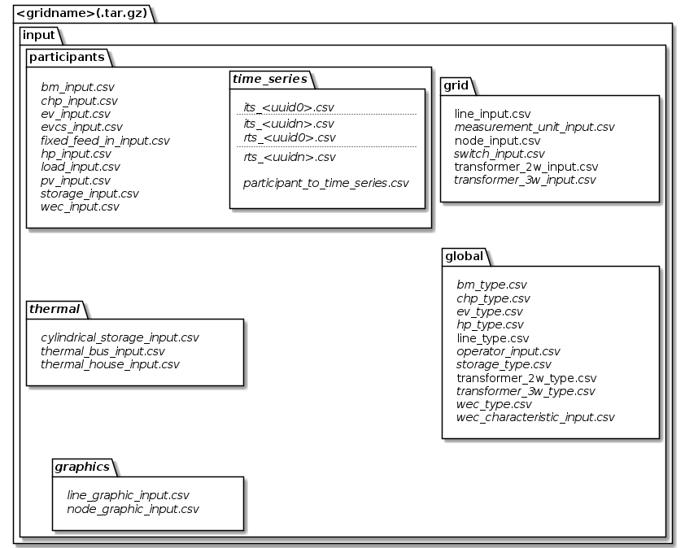
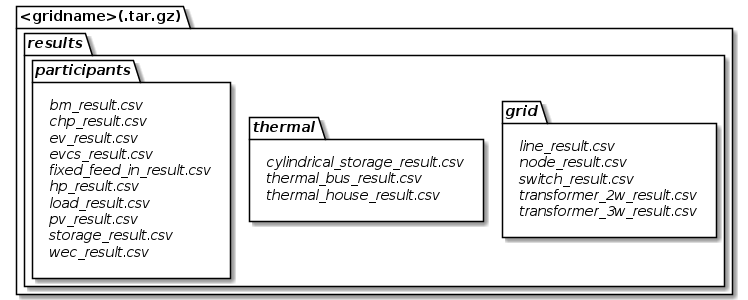
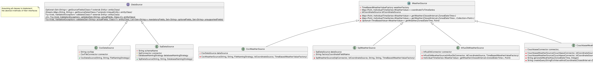

*********
csv files
*********

Naming of files
===============
A naming strategy provides a mapping between model classes and the names of the data sinks, in which the serialized
representation of several objects of this class can be found.
Currently we offer two different, pre-defined naming strategies, which you might extend to fit your needs:

1. **EntityPersistenceNamingStrategy**:
   A basic naming strategy that is able to add prefix and suffix to the names of the data sinks. A flat folder structure
   is considered. For more details see `Default naming strategy`_.
2. **HierarchicFileNamingStrategy**:
   An extended version of the EntityPersistenceNamingStrategy. Additionally, the `Default directory hierarchy`_ is taken
   into account. Please note, that this directory hierarchy is only meant to be used in conjunction with input models.

However, you can control the behaviour of serialization and de-serialization of models by injecting the desired naming
strategy you like into :code:`CsvDataSource` and :code:`CsvFileSink`.

Default naming strategy
=======================
There is a default mapping from model class to naming of data sinks in the case you would like to use csv files for
(de-)serialization of models.
You may extend / alter the naming with pre- or suffix by calling :code:
`new EntityPersistenceNamingStrategy("prefix","suffix")`.

Input
-----

+--------------------------------------------------------+--------------------------------------------------+
| Model                                                  | File Name                                        |
+========================================================+==================================================+
| :ref:`operator<operator_model>`                        | *prefix_*\ operator_input\ *_suffix*             |
+--------------------------------------------------------+--------------------------------------------------+
| :ref:`node<node_model>`                                | *prefix_*\ node_input\ *_suffix*                 |
+--------------------------------------------------------+--------------------------------------------------+
| :ref:`line<line_model>`                                | | *prefix_*\ line_input\ *_suffix*               |
|                                                        | | *prefix_*\ line_type_input\ *_suffix*          |
+--------------------------------------------------------+--------------------------------------------------+
| :ref:`switch<switch_model>`                            | *prefix_*\ switch_input\ *_suffix*               |
+--------------------------------------------------------+--------------------------------------------------+
| :ref:`two winding transformer<transformer2w_model>`    | | *prefix_*\ transformer2w_input\ *_suffix*      |
|                                                        | | *prefix_*\ transformer2w_type_input\ *_suffix* |
+--------------------------------------------------------+--------------------------------------------------+
| :ref:`three winding transformer<transformer3w_model>`  | | *prefix_*\ transformer3w_input\ *_suffix*      |
|                                                        | | *prefix_*\ transformer3w_type_input\ *_suffix* |
+--------------------------------------------------------+--------------------------------------------------+
| :ref:`measurement unit<measurement_unit_model>`        | *prefix_*\ measurement_unit_input\ *_suffix*     |
+--------------------------------------------------------+--------------------------------------------------+
| :ref:`biomass plant<bm_model>`                         | | *prefix_*\ bm_input\ *_suffix*                 |
|                                                        | | *prefix_*\ bm_type_input\ *_suffix*            |
+--------------------------------------------------------+--------------------------------------------------+
| :ref:`combined heat and power plant<chp_model>`        | | *prefix_*\ chp_input\ *_suffix*                |
|                                                        | | *prefix_*\ chp_type_input\ *_suffix*           |
+--------------------------------------------------------+--------------------------------------------------+
| :ref:`electric vehicle<ev_model>`                      | | *prefix_*\ ev_input\ *_suffix*                 |
|                                                        | | *prefix_*\ ev_type_input\ *_suffix*            |
+--------------------------------------------------------+--------------------------------------------------+
| :ref:`electric vehicle charging station<evcs_model>`   | *prefix_*\ evcs_input\ *_suffix*                 |
+--------------------------------------------------------+--------------------------------------------------+
| :ref:`fixed feed in facility<fixed_feed_in_model>`     | *prefix_*\ fixed_feed_in_input\ *_suffix*        |
+--------------------------------------------------------+--------------------------------------------------+
| :ref:`heat pump<hp_model>`                             | | *prefix_*\ hp_input\ *_suffix*                 |
|                                                        | | *prefix_*\ hp_type_input\ *_suffix*            |
+--------------------------------------------------------+--------------------------------------------------+
| :ref:`load<load_model>`                                | *prefix_*\ load_input\ *_suffix*                 |
+--------------------------------------------------------+--------------------------------------------------+
| :ref:`photovoltaic power plant<pv_model>`              | *prefix_*\ pc_input\ *_suffix*                   |
+--------------------------------------------------------+--------------------------------------------------+
| :ref:`electrical energy storage<storage_model>`        | | *prefix_*\ storage_input\ *_suffix*            |
|                                                        | | *prefix_*\ storage_type_input\ *_suffix*       |
+--------------------------------------------------------+--------------------------------------------------+
| :ref:`wind energy converter<wec_model>`                | | *prefix_*\ wec_input\ *_suffix*                |
|                                                        | | *prefix_*\ wec_type_input\ *_suffix*           |
+--------------------------------------------------------+--------------------------------------------------+
| :ref:`schematic node graphic<node_graphic_model>`      | *prefix_*\ node_graphic_input\ *_suffix*         |
+--------------------------------------------------------+--------------------------------------------------+
| :ref:`schematic line graphic<line_graphic_model>`      | *prefix_*\ line_graphic_input\ *_suffix*         |
+--------------------------------------------------------+--------------------------------------------------+

Time Series
-----------

+-------------------------------------------------------+---------------------------------------------+
| Model                                                 | File Name                                   |
+=======================================================+=============================================+
| :ref:`individual time series<individual_time_series>` | *prefix_*\ its\ *_columnScheme_UUID_suffix* |
+-------------------------------------------------------+---------------------------------------------+
| :ref:`load profile input<repetitive_time_series>`     | *prefix_*\ rts\ *_profileKey_UUID_suffix*   |
+-------------------------------------------------------+---------------------------------------------+

Let's spend a few more words on the individual time series:
Those files are meant to carry different types of content - one might give information about wholesale market prices,
the other is a record of power values provided by a real system.
To be able to understand, what's inside of the file, the *columnScheme* part of the file name gives insight of it's
content.
The following keys are supported until now:

+---------+----------------------------------------------------------------------------------------------------------------+
| Key     | Information and supported head line                                                                            |
+=========+================================================================================================================+
| c       | | An energy price (e.g. in €/MWh; c stands for charge).                                                        |
|         | | Permissible head line: ``uuid,time,price``                                                                   |
+---------+----------------------------------------------------------------------------------------------------------------+
| p       | | Active power                                                                                                 |
|         | | Permissible head line: ``uuid,time,p``                                                                       |
+---------+----------------------------------------------------------------------------------------------------------------+
| pq      | | Active and reactive power                                                                                    |
|         | | Permissible head line: ``uuid,time,p,q``                                                                     |
+---------+----------------------------------------------------------------------------------------------------------------+
| h       | | Heat power demand                                                                                            |
|         | | Permissible head line: ``uuid,time,h``                                                                       |
+---------+----------------------------------------------------------------------------------------------------------------+
| ph      | | Active and heat power                                                                                        |
|         | | Permissible head line: ``uuid,time,p,h``                                                                     |
+---------+----------------------------------------------------------------------------------------------------------------+
| pqh     | | Active, reactive and heat power                                                                              |
|         | | Permissible head line: ``uuid,time,p,q,h``                                                                   |
+---------+----------------------------------------------------------------------------------------------------------------+
| weather | | Weather information                                                                                          |
|         | | Permissible head line:                                                                                       |
|         | |     ``uuid,time,coordinate,direct_irradiation,diffuse_irradiation,temperature,wind_velocity,wind_direction`` |
+---------+----------------------------------------------------------------------------------------------------------------+

As the ``uuid`` and ``time`` field are mandatory, they are not mentioned explicitly, here.

Results
-------

+---------------------------------------------------------------+-----------------------------------------------+
| Model                                                         | File Name                                     |
+===============================================================+===============================================+
| :ref:`node<node_result>`                                      | *prefix_*\ node_res\ *_suffix*                |
+---------------------------------------------------------------+-----------------------------------------------+
| :ref:`line<line_result>`                                      | *prefix_*\ line_res\ *_suffix*                |
+---------------------------------------------------------------+-----------------------------------------------+
| :ref:`switch<switch_result>`                                  | *prefix_*\ switch_res\ *_suffix*              |
+---------------------------------------------------------------+-----------------------------------------------+
| :ref:`two winding transformer<transformer2w_result>`          | *prefix_*\ transformer2w_res\ *_suffix*       |
+---------------------------------------------------------------+-----------------------------------------------+
| :ref:`three winding transformer<transformer3w_result>`        | *prefix_*\ transformer3w_res\ *_suffix*       |
+---------------------------------------------------------------+-----------------------------------------------+
| :ref:`biomass plant<bm_result>`                               | *prefix_*\ bm_res\ *_suffix*                  |
+---------------------------------------------------------------+-----------------------------------------------+
| :ref:`combined heat and power plant<chp_result>`              | *prefix_*\ chp_res\ *_suffix*                 |
+---------------------------------------------------------------+-----------------------------------------------+
| :ref:`electric vehicle<ev_result>`                            | *prefix_*\ ev_res\ *_suffix*                  |
+---------------------------------------------------------------+-----------------------------------------------+
| :ref:`electric vehicle charging station<evcs_result>`         | *prefix_*\ evcs_res\ *_suffix*                |
+---------------------------------------------------------------+-----------------------------------------------+
| :ref:`fixed feed in<fixed_feed_in_result>`                    | *prefix_*\ fixed_feed_in_res\ *_suffix*       |
+---------------------------------------------------------------+-----------------------------------------------+
| :ref:`heat pump<hp_result>`                                   | *prefix_*\ hp_res\ *_suffix*                  |
+---------------------------------------------------------------+-----------------------------------------------+
| :ref:`load<load_result>`                                      | *prefix_*\ load_res\ *_suffix*                |
+---------------------------------------------------------------+-----------------------------------------------+
| :ref:`photovoltaic power plant<pv_result>`                    | *prefix_*\ pv_res\ *_suffix*                  |
+---------------------------------------------------------------+-----------------------------------------------+
| :ref:`storage<storage_result>`                                | *prefix_*\ storage_res\ *_suffix*             |
+---------------------------------------------------------------+-----------------------------------------------+
| :ref:`wind energy converter<wec_result>`                      | *prefix_*\ wec_res\ *_suffix*                 |
+---------------------------------------------------------------+-----------------------------------------------+
| :ref:`thermal house model<thermal_house_result>`              | *prefix_*\ thermal_house_res\ *_suffix*       |
+---------------------------------------------------------------+-----------------------------------------------+
| :ref:`cylindrical thermal storage<cylindricalstorage_result>` | *prefix_*\ cylindrical_storage_res\ *_suffix* |
+---------------------------------------------------------------+-----------------------------------------------+

Default directory hierarchy
===========================
Although there is no fixed structure of files mandatory, there is something, we consider to be a good idea of
structuring things.
You may either ship your csv files directly in this structure or compress everything in a .tar.gz file.
However, following this form, we are able to provide you some helpful tools in obtaining and saving your models a bit
easier.

   Default directory hierarchy for input classes

   Default directory hierarchy for result classes

The italic parts are optional and the others are mandatory.
As you see, this still is a pretty flexible approach, as you only need to provide, what you really need.
However, note that this hierarchy is only meant to be used in conjunction with input models, yet.

The class :code:`DefaultInputHierarchy` offers some helpful methods to validate and create a default input file
hierarchy.

De-Serialization (loading models)
=================================
Having an instance of :ref:`Grid Container<grid_container_model>` is most of the time the target whenever you load your
grid. It consists of the three main blocks:

   1. :ref:`Raw grid elements<grid_container_raw_grid_elements>`
   2. :ref:`System participants<grid_container_system_participants>`
   3. :ref:`Graphics<grid_container_graphics>`

Those blocks are also reflected in the structure of data source interface definitions.
There is one source for each of the containers, respectively.

   Class diagram of data sources

As a full data set has references among the models (e.g. a line model points to its' nodes it connects), there is a
hierarchical structure, in which models have to be loaded.
Therefore, the different sources have also references among themselves.
An application example to load an *exampleGrid* from csv files located in :code:`./exampleGrid` could look like this:

.. code-block:: java

   /* Parameterization */
   String gridName = "exampleGrid";
   String csvSep = ",";
   String folderPath = "./exampleGrid";
   EntityPersistenceNamingStrategy namingStrategy = new EntityPersistenceNamingStrategy(); // Default naming strategy

   /* Instantiating sources */
   TypeSource typeSource = new CsvTypeSource(csvSep, folderPath, namingStrategy);
   RawGridSource rawGridSource = new CsvRawGridSource(csvSep, folderPath, namingStrategy, typeSource);
   ThermalSource thermalSource = new CsvThermalSource(csvSep, folderPath, namingStrategy, typeSource);
   SystemParticipantSource systemParticipantSource = new CsvSystemParticipantSource(
           csvSep,
           folderPath,
           namingStrategy,
           typeSource,
           thermalSource,
           rawGridSource
   );
   GraphicSource graphicsSource = new CsvGraphicSource(
           csvSep,
           folderPath,
           namingStrategy,
           typeSource,
           rawGridSource
   );

   /* Loading models */
   RawGridElements rawGridElements = rawGridSource.getGridData().orElseThrow(
           () -> new SourceException("Error during reading of raw grid data."));
   SystemParticipants systemParticipants = systemParticipantSource.getSystemParticipants().orElseThrow(
           () -> new SourceException("Error during reading of system participant data."));
   GraphicElements graphicElements = graphicsSource.getGraphicElements().orElseThrow(
           () -> new SourceException("Error during reading of graphic elements."));
   JointGridContainer fullGrid = new JointGridContainer(
           gridName,
           rawGridElements,
           systemParticipants,
           graphicElements
   );

As observable from the code, it doesn't play a role, where the different parts come from.
It is also a valid solution, to receive types from file, but participants and raw grid elements from a data base.
Only prerequisite is an implementation of the different interfaces for the desired data source.

Serialization (writing models)
==============================
Serializing models is a bit easier:

.. code-block:: java

   /* Parameterization */
   String csvSep = ",";
   String folderPath = "./exampleGrid";
   EntityPersistenceNamingStrategy namingStrategy = new EntityPersistenceNamingStrategy();
   boolean initEmptyFiles = false;

   /* Instantiating the sink */
   CsvFileSink sink = new CsvFileSink(folderPath, namingStrategy, initEmptyFiles, csvSep);
   sink.persistJointGridContainer(grid);

The sink takes a collection of model suitable for serialization and handles the rest (e.g. unboxing of nested models)
on its own.
But caveat: As the (csv) writers are implemented in a concurrent, non-blocking way, duplicates of nested models could
occur.

Compression and extraction of files
===================================
We consider either regular directories or compressed `tarball archives <https://en.wikipedia.org/wiki/Tar_(computing)>`_
(:code:`*.tar.gz`) as source of input files.
The class :code:`TarballUtils` offers some helpful functions to compress or extract input data files for easier shipping.