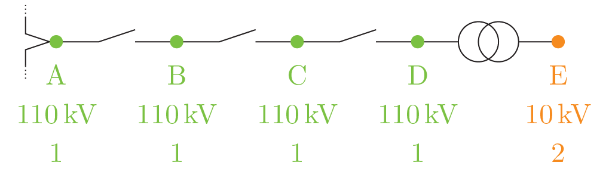
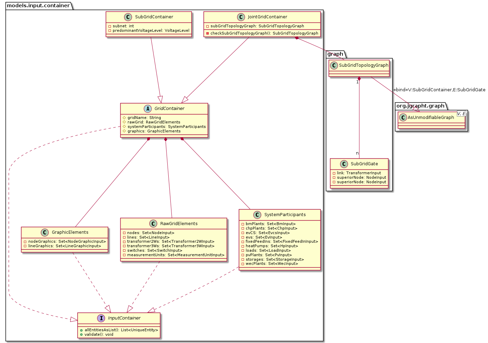

# Grid Container

The grid container groups all entities that are able to form a full grid model.
Two types of grid containers are available:

**JointGridContainer** <br>
This one is able to hold a grid model spanning several voltage levels.
On instantiation, a sub grid topology graph is built.
This graph holds `SubGridContainers` as vertices and transformer models as edges.
Thereby, you are able to discover the topology of galvanically separated sub grids and access those sub models
directly.

and

**SubGridContainer** <br>
This one is meant to hold all models, that form a galvanically separated sub grid.
In contrast to the `JointGridContainer` it only covers one voltage level and therefore has an additional field
for the predominant voltage level apparent in the container.
Why predominant?
As of convention, the `SubGridContainers` hold also reference to the transformers leading to higher sub grids
and their higher voltage coupling point.



Let's shed a more detailed light on the boundaries of a sub grid as of our definition.
This especially is important, if the switchgear of the transformer is modeled in detail.
We defined, that all nodes in upstream direction of the transformer, that are connected by switches *only* (therefore
are within the switchgear) are counted towards the inferior sub grid structure (here "2"), although they belong to a
different voltage level.
This decision is taken, because we assume, that the interest to operate on the given switchgear will most likely be
placed in the inferior grid structure.

The "real" coupling node A is not comprised in the sub grids node collection, but obviously has reference through the
switch between nodes A and B.

A synoptic overview of both classes' attributes is given here:

## Attributes, Units and Remarks

```{eval-rst}
.. list-table::
   :widths: 33 33 33
   :header-rows: 1


   * - Attribute
     - Unit
     - Remarks

   * - gridName
     - –
     - Human readable identifier

   * - rawGrid
     - –
     - see below

   * - systemParticipants
     - –
     - see below

   * - graphics
     - –
     - see below

   * - subGridTopologyGraph
     - –
     - topology of sub grids - only
       ``JointGridContainer``

   * - predominantVoltageLevel
     - –
     - main voltage level - only
       ``SubGridContainer``

   * - subnet
     - –
     - sub grid number - only
       ``SubGridContainer``

```

### RawGridElements
This sub container simply holds:

* [nodes](/models/input/grid/node)
* [lines](/models/input/grid/line)
* [switches](/models/input/grid/switch)
* [two winding transformers](/models/input/grid/transformer2w)
* [three winding transformers](/models/input/grid/transformer3w)
* [measurement units](/models/input/grid/measurementunit)


### SystemParticipants
This sub container simply holds:

* [biomass plant](/models/input/participant/bm)
* [combined heat and power plant](/models/input/participant/chp)
- [electric vehicles](/models/input/participant/ev)
- [electric vehicle charging stations](/models/input/participant/evcs)
- [fixed feed in facilities](/models/input/participant/fixedfeedin)
- [heat pumps](/models/input/participant/hp)
- [loads](/models/input/participant/load)
- [photovoltaic power plants](/models/input/participant/pv)
- [electrical energy storages](/models/input/participant/storage)
- [wind energy converters](/models/input/participant/wec)

and the needed nested thermal models.


### Graphics
This sub container simply holds:

* [schematic node graphics](/models/input/grid/nodegraphic)
* [schematic line graphics](/models/input/grid/linegraphic)


## Container Concept



## Caveats
Nothing - at least not known.
If you found something, please contact us!
