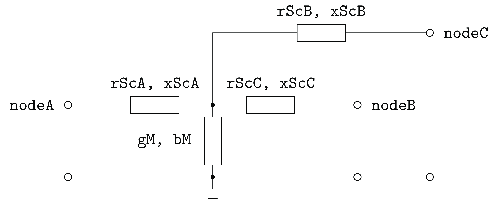

.. _transformer3w_model:

Three Winding Transformer
-------------------------
Model of a three winding transformer.
It is assumed, that node A is the node with highest, node B with intermediate and node C with lowest voltage.

The assumed mathematical model is inspired by *ABB Schaltanlagenhanbuch* [Gremmel1999]_, but with the addition of a
central phase-to-ground admittance, cf. following picture.

   "Star like" T-equivalent circuit diagram of a three winding transformer

.. _transformer3w_attributes:

Attributes, Units and Remarks
^^^^^^^^^^^^^^^^^^^^^^^^^^^^^

.. _transformer3w_type_attributes:

Type Model
""""""""""
All impedances and admittances are given with respect to the higher voltage side.

+-----------+------+---------------------------------------------------------+
| Attribute | Unit | Remarks                                                 |
+===========+======+=========================================================+
| uuid      |      |                                                         |
+-----------+------+---------------------------------------------------------+
| id        |      | Human readable identifier                               |
+-----------+------+---------------------------------------------------------+
| rScA      | Ω    | Short circuit resistance in branch A                    |
+-----------+------+---------------------------------------------------------+
| rScB      | Ω    | Short circuit resistance in branch B                    |
+-----------+------+---------------------------------------------------------+
| rScC      | Ω    | Short circuit resistance in branch C                    |
+-----------+------+---------------------------------------------------------+
| xScA      | Ω    | Short circuit impedance in branch A                     |
+-----------+------+---------------------------------------------------------+
| xScB      | Ω    | Short circuit impedance in branch B                     |
+-----------+------+---------------------------------------------------------+
| xScC      | Ω    | Short circuit impedance in branch C                     |
+-----------+------+---------------------------------------------------------+
| gM        | nS   | No load conductance                                     |
+-----------+------+---------------------------------------------------------+
| bM        | nS   | No load susceptance                                     |
+-----------+------+---------------------------------------------------------+
| sRatedA   | kVA  | Rated apparent power of branch A                        |
+-----------+------+---------------------------------------------------------+
| sRatedB   | kVA  | Rated apparent power of branch B                        |
+-----------+------+---------------------------------------------------------+
| sRatedC   | kVA  | Rated apparent power of branch C                        |
+-----------+------+---------------------------------------------------------+
| vRatedA   | kV   | Rated voltage at higher node A                          |
+-----------+------+---------------------------------------------------------+
| vRatedB   | kV   | Rated voltage at higher node B                          |
+-----------+------+---------------------------------------------------------+
| vRatedC   | kV   | Rated voltage at higher node C                          |
+-----------+------+---------------------------------------------------------+
| dV        | %    | Voltage magnitude increase per tap position             |
+-----------+------+---------------------------------------------------------+
| dPhi      | °    | Voltage angle increase per tap position                 |
+-----------+------+---------------------------------------------------------+
| tapNeutr  |      | Neutral tap position                                    |
+-----------+------+---------------------------------------------------------+
| tapMin    |      | Minimum tap position                                    |
+-----------+------+---------------------------------------------------------+
| tapMax    |      | Maximum tap position                                    |
+-----------+------+---------------------------------------------------------+

.. _transformer3w_entity_attributes:

Entity Model
""""""""""""

+-----------------+------+--------------------------------------------------------+
| Attribute       | Unit | Remarks                                                |
+=================+======+========================================================+
| uuid            | --   |                                                        |
+-----------------+------+--------------------------------------------------------+
| id              | --   | Human readable identifier                              |
+-----------------+------+--------------------------------------------------------+
| operator        | --   |                                                        |
+-----------------+------+--------------------------------------------------------+
| operationTime   | --   | Timely restriction of operation                        |
+-----------------+------+--------------------------------------------------------+
| nodeA           | --   | Higher voltage node                                    |
+-----------------+------+--------------------------------------------------------+
| nodeB           | --   | Intermediate voltage node                              |
+-----------------+------+--------------------------------------------------------+
| nodeC           | --   | Lowest voltage node                                    |
+-----------------+------+--------------------------------------------------------+
| parallelDevices | --   | Amount of parallel devices of same attributes          |
+-----------------+------+--------------------------------------------------------+
| type            | --   |                                                        |
+-----------------+------+--------------------------------------------------------+
| tapPos          | --   | Current position of the tap changer                    |
+-----------------+------+--------------------------------------------------------+
| autoTap         | --   | true, if there is a tap regulation apparent and active |
+-----------------+------+--------------------------------------------------------+

.. _transformer3w_caveats:

Caveats
^^^^^^^
Nothing - at least not known.
If you found something, please contact us!

.. [Gremmel1999] Gremmel, H., Ed., Schaltanlagen. Cornelsen Verlag, 1999, Vol. 10, isbn: 3-464-48235-9.